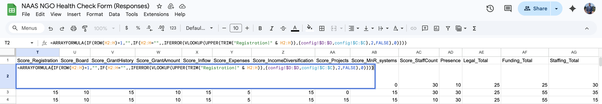
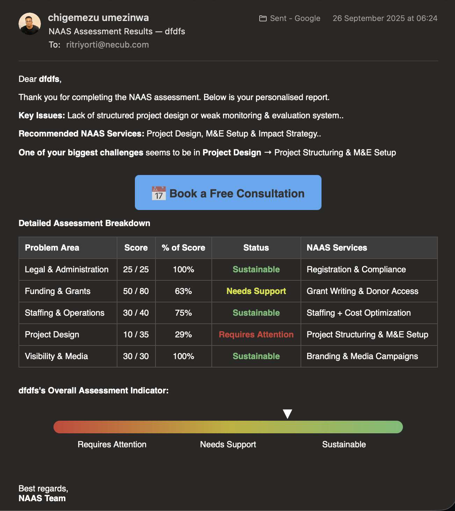

# NAAS (NGO-As-A-Service) Client Intake Analytics

Executive Summary
------

This project is an automated NGO capacity assessment engine built using Google Sheets and Google Apps Script.

The system operationalizes qualitative survey data into a structured, weighted scoring model that evaluates organizational readiness across multiple domains. Responses are normalized, aggregated into key problem area indices, and combined into a composite maturity score used for segmentation and qualification.

 Measurable Impact:
 
	•	Reduced report generation time by approximately 80%
	•	Eliminated an estimated 8–12 hours of manual review per week
	•	Scaled to handle over 1000 respondents per week
	•	Standardized evaluation criteria, removing subjective bias in qualification decisions
	•	Improved consultation efficiency through pre-call analytical reporting

The result is a lightweight decision-support system that integrates data modeling, automation, and reporting into a scalable operational workflow.

Project Overview
------
Many small and mid-sized NGOs struggle to clearly understand their operational capacity, funding readiness, and growth gaps. As a result, support organizations often provide generic advice instead of targeted solutions.

This project was built to solve that problem.

I designed and automated a data-driven assessment engine that:

	•	Collects structured responses from NGOs
	•	Transforms qualitative inputs into quantitative scores
	•	Segments organizations by capacity level
	•	Automatically generates personalized analytical reports
	•	Recommends targeted solutions based on performance gaps

This project includes a **Google Apps Script** that automates the processing of NGO assessment submissions from a Google Sheet. It calculates scores, generates insights, emails respondents, and stores PDF reports in Google Drive.

### How It Works

1. **Trigger:**  
   - The script runs automatically on form submission (`onFormSubmit`).

2. **Data Extraction:**  
   - Reads respondent data from the Google Sheet, including scores in five areas:
     - Legal & Administration
     - Funding & Grants
     - Staffing & Operations
     - Project Design
     - Visibility & Media

3. **Score Calculation:**  
   - Calculates **per-area percentages** based on predefined maxima.
   - Determines status using thresholds:
     - `Sustainable` (≥70%)
     - `Needs Support` (34–69%)
     - `Requires Attention` (<34%)
   - Computes **overall score and status** for the organization.

4. **Insights Generation:**  
   - Highlights the **biggest challenge area** (lowest percentage).
   - Maps each area to a recommended NAAS service.
   - Builds an HTML table summarizing scores, percentages, status, and services.

5. **Automated Emails:**  
   - Sends a personalized email to the respondent with:
     - Key issues
     - Recommended services
     - Biggest challenge area
     - Link to book a consultation
     - Detailed assessment table

6. **PDF Generation & Storage:**  
   - Converts the assessment breakdown into a PDF.
   - Saves the PDF in a Google Drive folder structured by organization name.
   - Sends a copy to the company email for records.

7. **Error Handling & Tracking:**  
   - Validates email addresses.
   - Logs the status of each email in the `Mail Status` column.
   - Tracks failures with descriptive messages.

### Example Insight Table (HTML Email & PDF)

| Problem Area           | Score       | % of Score | Status              | NAAS Services                     |
|------------------------|------------|------------|-------------------|----------------------------------|
| Legal & Administration | 15 / 25    | 60%        | Needs Support       | Registration & Compliance        |
| Funding & Grants       | 80 / 80    | 100%       | Sustainable        | Grant Writing & Donor Access     |
| Staffing & Operations  | 25 / 40    | 63%        | Needs Support       | Staffing + Cost Optimization     |
| Project Design         | 30 / 35    | 86%        | Sustainable        | Project Structuring & M&E Setup  |
| Visibility & Media     | 25 / 30    | 83%        | Sustainable        | Branding & Media Campaigns       |

**Overall Assessment:** `Sustainable` ✅

---

This setup allows **automated, consistent, and auditable scoring** while reducing manual workload, improving decision-making, and delivering actionable insights to respondents and internal stakeholders.

The Business Problem
------

Manual assessment processes created three major issues:

	❌ No standardized evaluation framework
	❌ Time-consuming manual report writing
	❌ Generic recommendations not tailored to organizational needs

The goal was to build a lightweight, scalable system that:

	✅ Standardizes evaluation criteria
	✅ Automates scoring logic
	✅ Produces actionable, personalized feedback
	✅ Reduces turnaround time from hours to minutes

Screenshots/ Sample Output
------
 

 

	To eliminate manual work, I developed an Apps Script automation layer that:
	- Detects new responses
	- Calculates scoring outputs
	- Generates a personalized analytical report
	- Sends automated emails with:
		✔ Performance summary
		✔ Identified weaknesses
		✔ Strategic recommendations

	This converted the sheet into a fully automated assessment engine.

---
 

This image displays a customized NAAS Assessment Results email sent individually to clients.

✔  It outlines the organization’s performance across five core areas, using scores to determine whether each area is sustainable or requires additional support.
  
✔  Based on these results, tailored service recommendations are provided.

✔  At the bottom, a visual performance bar indicates the overall standing, positioned between “Needs Support” and “Sustainable.”

✔  The email also features a clear call-to-action button encouraging the recipient to schedule a free consultation.

- [All Apps Script Files](AppScript/)
- [All Documentation Files](scoring-logic/)

